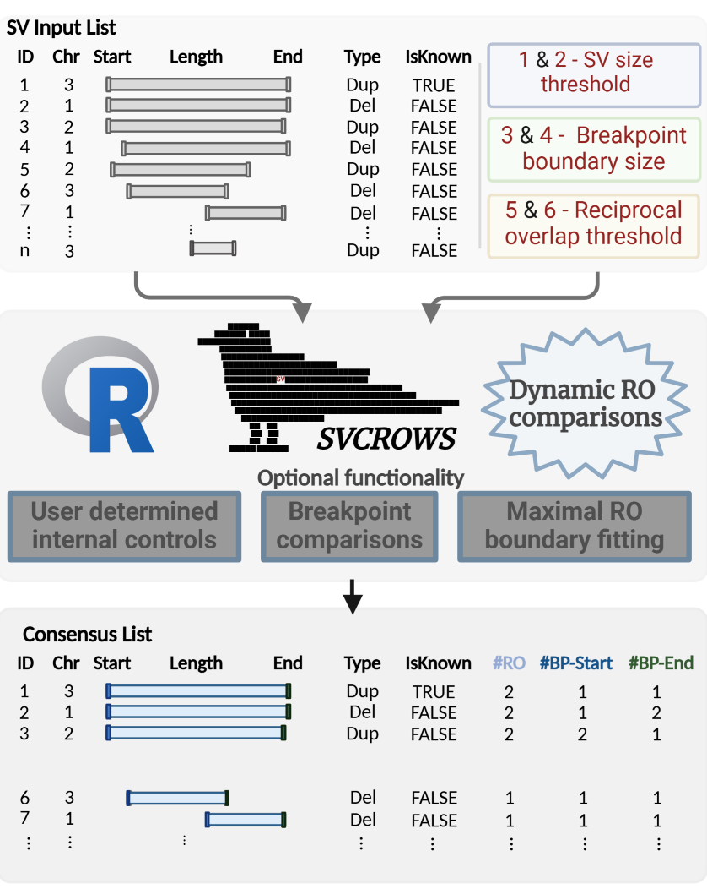
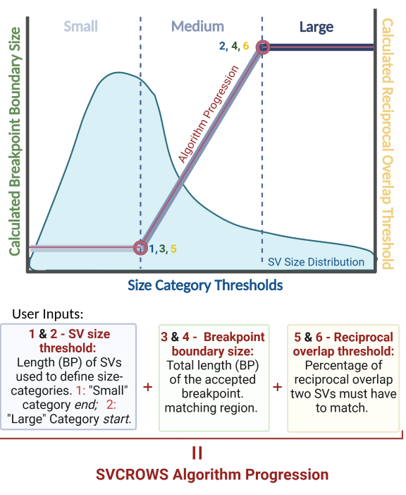
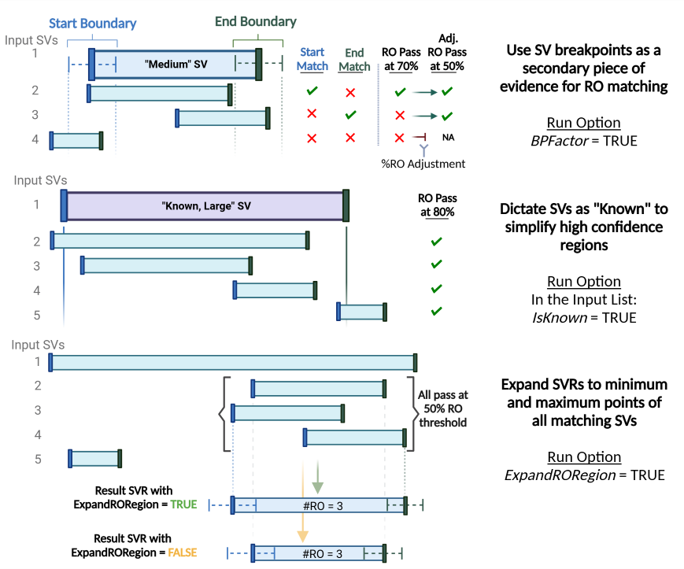

# SVCROWS: Structural Variation Consensus with Reciprocal Overlap and Weighted Sizes
## Authors
[Noah Brown](www.linkedin.com/in/noah-brown456), Charles Danis, Vazira Ahmedjonova, PI: [Jennifer Guler](https://bio.as.virginia.edu/people/jennifer-guler)
## Publication
[Temporary Link to Publication](https://www.youtube.com/watch?v=dQw4w9WgXcQ)
## Description
Structural variants (SVs), or large rearrangements of the genome, are prevalent in critical organism phenotypes and human diseases. There are several tools for defining unique SVs across different datasets, however, most fail to delineate SVs in a region that constitute significant biological differences in order to simplify downstream analyses. Further, these tools lack user options to tailor the stringency in those calls specifically for the dataset limitations or genomic background of the study organism. Here we present a user-friendly R-based package, SVCROWS, that provides users options to produce meaningfully different SV regions based on reciprocal overlap dependent on SV size. Further, this program optionally uses break point matching between SVs as a second piece of information to determine if SVs are the same. These, along with other features make SVCROWS a versatile and malleable tool for categorizing SVs.

{ width="90%" }

## Instalation in R
SVCROWS requires several R packages to be manually installed: "dplyr", "tidyverse", and "purrr". 
It can then be downloaded with

```
install.packages("devtools")
library(devtools) <- will require a reload if this is the first time installing
install_github("A-Crow-Nowhere/SVCROWS.git")
devtools::loadall(".")
```

## Input and Output formats
SVCROWS has strict text-based input and output formats. When assessing matching values, it uses a '0' hamming distance (i.e., values must be an exact match). For detailed descriptions of every column in the inputs and outputs, see SVCROWS/FormattingGuides. For example data used in the original publication, see SVCROWS/ExampleData

SVCROWS Requires 6 user inputs to define stringency in the matching protocol. This creates the SVCROWS algorithm progression. (see publication for full details)



### Functions and Options



i)	SVCROWS can generate default values for these 6 parameters based on the first and third quartile of the SV-size distribution of the dataset. It is important to note that using this option will adjust its parameters to each new file in the input directory. However, this is not recommended because it may not tailor the program to user needs. 

ii)	SVCROWS uses breakpoint matching between SVs as a secondary piece of information to determine the similarity between two SVs. The user input determines breakpoint boundary sizes. As potential SVs are compared, the start or end breakpoint must fall within the boundary to be considered a match. Start boundaries cannot match with end boundaries and vice versa. When a breakpoint matches, SVCROWS can interpret this as a high likelihood of a match and adjusts the RO threshold to the minimum value (input 5) provided by the user (green arrows). If potential SVs are already at the minimum, there is no change. Breakpoints matching is counted and recorded on the consensus list only once, to the first match found in the consensus list, but subsequent matches will continue to adjust RO thresholds after it is counted.

iii)	The input SV list required by SVCROWS has an optional distinction to indicate a potential SV as a “Known” SV. This characterization reduces the RO requirement to a single base pair. For example, this option can be used for SVs that have been previously identified and have definite positions in the genetic background of an organism. Therefore, a user can have high confidence that any overlapping SVs in this region are derived from the “known” SV, and any variation in SVs compared in this region is not biological. 

iv)	SVCROWS provides an option to expand SVRs with multiple matches to the minimum and maximum position of the subset of matching SVs. Using this option adjusts the breakpoint regions for the newly constructed region during the run itself. Breakpoint matching is still tabulated in the same way.

v)	SVCROWS includes an alternative mode (“Hunt” mode), where a user inputs both 1) a set of SVs or SVRs in the same input format as described for “Scavenge” mode, and 2) A set of features (i.e. genes from a relevant genome). Using the same weighted-sizes principle, SVCROWS will quantify how many times features are significantly overlapped by the supplied user input SVs. However, this calculation is done non-reciprocally and only considers the overlap of the features to call matching SVs. 

The ‘feature list’ has the same requirements as the ‘input list’ but only contains the: “Chr”, “Start”, “End”, “Type”, “Var1”, “Var2”, and “Var3” headers (See ExampleData/FeatureList.HG38PCGs.tsv). 

During runtime, the user must provide the same 6 variables as in “scavenge” mode, but consider inputs that apply to the characteristics of the desired features themselves, rather than the input SVs. This mode returns similar outputs as the “Scavenge” mode, but the consensus list represents the quantification of each feature given to the program. 

vi)	There are several tools and functions for quantifying the resulting SVRs. Incorporated into the ‘input list’ are the variables “NumReads” and “QScore”, which are added and averaged (respectively) as individual SVs match into their final SVR (see Usage for further functionality). SVCROWS also has a “Summary” function, that will provide summary information of the final SVR output.


## Global Setup Instructions for SVCROWS

This guide shows how to install the `SVCROWS` R package and expose its R functions and Bash scripts globally from **any shell or Conda environment**.

---

### 1. Create a Conda Environment

First, create and activate the environment that supports the `SVCROWS` package:

```bash
# Save this as svcrows-env.yaml
cat <<EOF > svcrows-env.yaml
name: svcrows-env
channels:
  - conda-forge
dependencies:
  - r-base >=4.2,<4.4
  - r-dplyr
  - r-purrr
  - r-tidyverse
  - r-stringr
  - r-stringi
  - r-cli
  - git
  - r-devtools
EOF

# Create and activate the environment
conda env create -f svcrows-env.yaml
conda activate svcrows-env
```

---

### 2. Clone and Install SVCROWS

```bash
git clone https://github.com/A-Crow-Nowhere/SVCROWS.git
cd SVCROWS

# Compatability bug: reinstall stringi from source if needed (to fix ICU errors)
# only do this if the following steps return errors regarding stringi
Rscript -e 'install.packages("stringi", type = "source", repos = "https://cloud.r-project.org")'

# Install the package
Rscript -e 'devtools::install(".")'
```

---

### 3. Expose SVCROWS Commands Globally

This step creates global shell commands like `scavenge` and `hunt` that work **from any shell or Conda environment** by wrapping R calls via `conda run`.

#### Create `~/bin` if it doesn't exist:

```bash
# Bin is generally where programs go, but you can define any folder (including a subfolder of SVCROWS package) to add to your global path.
mkdir -p ~/bin
```

Make sure `~/bin` is on your PATH (add this to your `~/.bashrc` or `~/.zshrc` if needed):

```bash
export PATH="$HOME/bin:$PATH"
```

Then reload your shell:

```bash
source ~/.bashrc  # or ~/.zshrc
```

#### Create wrapper scripts

```bash
# run from the repo root
install -m 0755 scripts/scavenge           ~/bin/scavenge
install -m 0755 scripts/hunt               ~/bin/hunt
install -m 0755 scripts/bed_to_vcf.sh      ~/bin/bed_to_vcf.sh
install -m 0755 scripts/crows_to_vcf.sh    ~/bin/crows_to_vcf.sh
install -m 0755 scripts/crows_to_bed.sh    ~/bin/crows_to_bed.sh
install -m 0755 scripts/vcf_to_bed.sh      ~/bin/vcf_to_bed.sh
install -m 0755 scripts/vcf_to_svcrows.sh  ~/bin/vcf_to_crows.sh

# (optional) ensure ~/bin is on PATH
case ":$PATH:" in *":$HOME/bin:"*) :;; *) echo 'export PATH="$HOME/bin:$PATH"' >> ~/.bashrc; source ~/.bashrc;; esac

# quick sanity
command -v scavenge && command -v hunt
```

Now you can run from anywhere:

```bash
scavenge ....
hunt ....
```

---

### 4. Make Bash Scripts Globally Available

If the repo contains useful bash tools in the `scripts/` directory, you can make them globally executable:

```bash
# From inside the cloned SVCROWS repo
cp scripts/*.sh ~/bin/
chmod +x ~/bin/*.sh
```

(Optional) Remove `.sh` extensions for cleaner usage:

```bash
for f in ~/bin/*.sh; do mv "$f" "${f%.sh}"; done
```

Now you can run those scripts in the CLI like:

```bash
scavenge input.txt output.txt
```

---

### Final Test

You should now be able to run all the following **from any location or Conda environment**:
All functions have an embedded help command to instruct usage.
```bash
scavenge some_file.vcf output.tsv
hunt other_input.tsv results.tsv
myscriptname input.txt output.txt
```

---


## Running in R
SVCROWS runs input files from entire directories and writes them into an output directory. The InputQueryList and OutputDirectory must therefore be directories.
### "Scavenge" Mode

```
Scavenge(InputQueryList = "~/user/R/SVCROWSin", OutputDirectory = "~/user/R/SVCROWSout", ExpandRORegion = FALSE, BPfactor = TRUE, DefaultSizes = FALSE, xs =  5000, xl = 25000, y1s= 500, y1l = 2500, y2s = 50, y2l = 80)
Scavenge(InputQueryList = "~/user/R/SVCROWSin", OutputDirectory = "~/user/R/SVCROWSout", ExpandRORegion = TRUE, BPfactor = TRUE, DefaultSizes = TRUE)
```
### "Hunt" Mode

```
Hunt(InputQueryList = "~/user/R/SVCROWSin", FeatureList = "~/user/R/SVCROWSin/Featurelist.tsv", OutputDirectory = "~/user/R/SVCROWSout", BPfactor = TRUE, DefualtSizes = FALSE, xs = 3000, xl = 6000, y1s = 300, y1l = 600, y2s = 30, y2l = 60)
Hunt(InputQueryList = "~/user/R/SVCROWSin", FeatureList = "~/user/R/SVCROWSin/Featurelist.tsv", OutputDirectory = "~/user/R/SVCROWSout", BPfactor = TRUE, DefualtSizes = TRUE)
```

### Other Functions

```
#for Summarizing all FCL output in the output directory. Will write to a file
SVCSummarize(OutputDirectory = "~/R/SVCROWS2/SVCROWSout", OutputFile ="~/R/SVCROWS2/SVCROWSout/summary.tsv")

#Converts FCL output to clean, input files
ConsensusToQuery("~/user/R/ConsensusList.tsv", "~/user/R/QueryListOut.tsv")

#Takes a list of files containing SV/SVR information (i.e. from a list of single cell samples) and adds them all into the same file for downstream analysis
ConcatSamples(Indirectory, Outdirectory)
```

### Future Updates
General speed/preformance improvments
Functions for converting between VCF and SVCROWS input/output formats


## Acknowledgements
This work was funded by the NIH: RO1 AI150856

[Julia Żuławińska](https://www.linkedin.com/in/julia-zulawinska/) for coding support
Crows (the animal) in general, for being pretty cool
